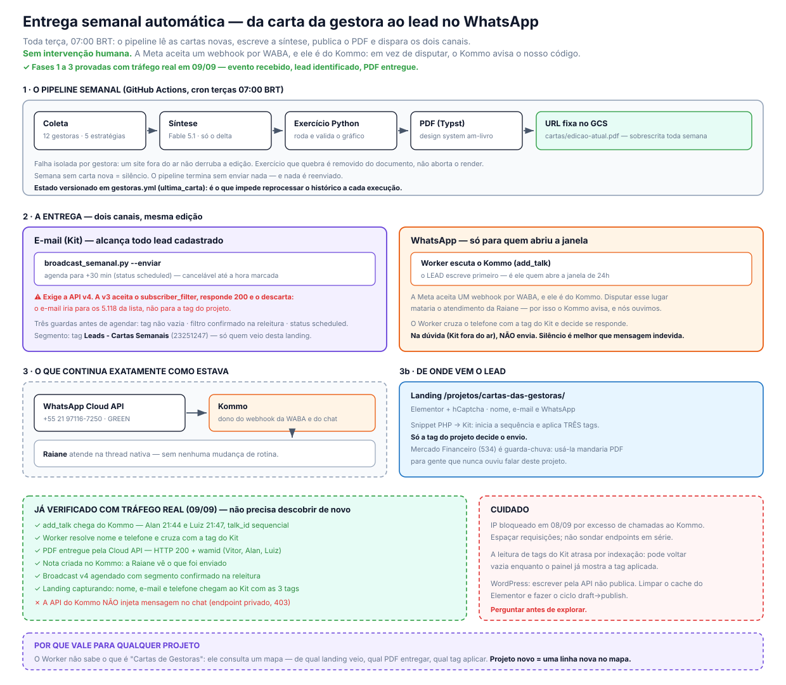

# Hub de WhatsApp — arquitetura



Editável: `arquitetura-whatsapp-hub.excalidraw`

## O problema, em uma frase

**A WABA aceita UM webhook, e ele está com o Kommo.** Verificado em
`GET /{WABA}/subscribed_apps`: só o app Kommo (`1022173854571346`) está inscrito.
Hoje é **saída pela Cloud API, entrada pelo Kommo** — quando alguém responde, cai
no board da Raiane.

Conectar o ManyChat (ou qualquer outro provedor) exigiria **substituir** o Kommo,
o que quebraria o atendimento do número principal. Foi esse o impasse.

## A inversão que destrava

Em vez de escolher entre Kommo *ou* automação, **o webhook passa a ser nosso** — um
Cloudflare Worker que recebe tudo e decide o destino de cada mensagem:

- mensagem para o número de captação → responde o PDF, agenda o D+1
- mensagem para o número de atendimento → repassa ao Kommo, intacto

O Kommo continua recebendo o que sempre recebeu. Nada muda para a Raiane.

## Por que é rápido de implementar

Quase tudo já existe, e foi verificado hoje (2026-09-09):

| Peça | Estado |
|---|---|
| Token com `whatsapp_business_messaging` | System User, **não expira** |
| Cloudflare Workers | **4 em produção** (nucleos, imersão, MPP, cartas) |
| Ponte WordPress → ConvertKit | testada: nome, telefone e tag chegam |
| PDF em URL fixa | no GCS, atualizado pelo pipeline toda terça |
| Kommo | API e token longo no `.env` do ROI |
| Cron para o D+1 | nativo do Workers (`scheduled`) |

**Falta:** número novo na WABA, trocar o webhook, ~200 linhas de Worker e o mapa
de projetos no KV. Nenhuma infra nova.

## Por que escala para qualquer projeto

O hub **não sabe** o que é "Cartas de Gestoras". Ele lê o número de destino e
consulta um mapa no KV:

```json
{
  "5521XXXXXXXX": {
    "projeto": "cartas-de-gestoras",
    "pdf": "https://storage.googleapis.com/am-social-assets/cartas/edicao-atual.pdf",
    "tag_kit": 22406993,
    "sequencia_kit": 2888305,
    "boas_vindas": "Oi, {nome}! Aqui está a síntese desta semana 👇",
    "followup_h": 24
  }
}
```

Projeto novo = **uma linha nova no mapa**. Zero código, zero deploy.

Se um dia forem muitos projetos num número só, o roteamento passa a ser pela
palavra-chave da primeira mensagem — a mesma lógica, outra chave de busca.

## Duas decisões que ficam para o Vitor

1. **Um número por projeto, ou um número para todos?** Um número para todos é mais
   barato e simples; um por projeto separa métrica e reputação.
2. **O que o hub faz quando não reconhece o número/palavra?** O padrão seguro é
   repassar ao Kommo — melhor um humano ler do que a mensagem sumir.

## Ordem de implementação sugerida

1. Número novo na WABA (verificação por SMS, ~15 min)
2. Worker com o roteador e o repasse ao Kommo — **testar que nada quebrou**
3. Só então a resposta automática do PDF
4. Por último o D+1, que é o mais delicado (janela de 24h)

O passo 2 é o mais importante: enquanto ele não estiver provado, não vale ligar o
resto. É o que garante que o atendimento atual continua intacto.
